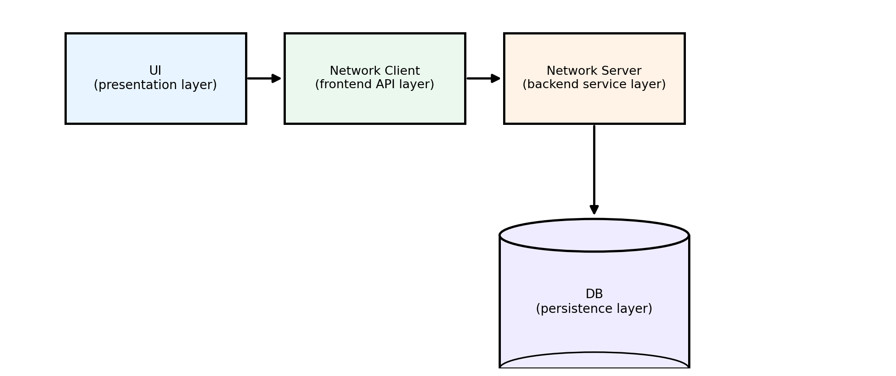
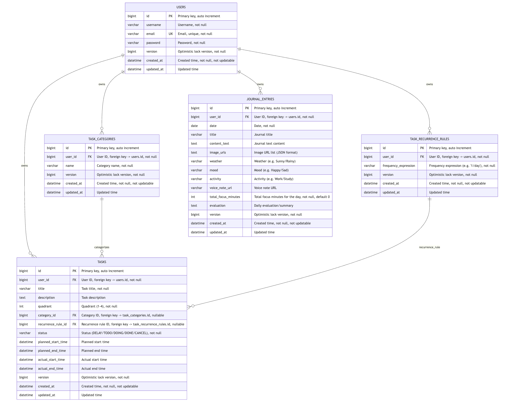

# AsteriTime - Daily Timeline with Pomodoro, Quadrant Tasks, Journal, and Analytics

**Links:**
-  [GitHub Repository](https://github.com/XuchengHuang/JavaFinal) 
-  [Video Demo]()

## Project Overview

AsteriTime is a **time management and productivity web application** for everyday study and work.  
It uses Java/Spring Boot on the backend and React on the frontend to provide a full loop from *planning → scheduling → focused execution → reflection & analytics*.  
Main features:
- **Eisenhower Dashboard**: quadrant-based prioritization (urgent/important) to help users decide what to do now, schedule, delegate, or drop.
- **Day Timeline**: a visual day timeline showing planned and completed tasks, making time allocation and gaps easy to see.
- **Pomodoro Timer**: focus timer with short/long breaks, linked to tasks so work sessions can be tracked.
- **Analytics**: daily/weekly charts for focus time, task completion and time distribution to support reflection.
- **Journal**: daily journal entries for thoughts and reflections, which can be combined with analytics for qualitative and quantitative review.


## Tech Stack

### System Architecture

AsteriTime follows a classic three-tier, client–server architecture:

**UI (presentation layer)** → **Network Client (frontend API layer)** → **Network Server (backend service layer)** → **DB (persistence layer)**



- **UI layer**: React-based UI providing task management, timeline, Pomodoro, analytics and journal views.
- **Network Client layer**: frontend API module that wraps HTTP requests, handles responses, and manages authentication tokens (JWT).
- **Network Server layer**: Spring Boot backend that exposes RESTful APIs and handles business logic, validation, and access control.
- **DB layer**: MySQL database for durable storage of users, tasks, journal entries and related business data.

Data flow: user interaction in the UI → Network Client sends HTTP request → Network Server processes the request and accesses the database → response is returned → UI updates the view.

### Backend Stack

| Technology | Version | Description |
|------|------|------|
| **Java** | 21 | JDK 21 (Eclipse Temurin) |
| **Spring Boot** | 2.7.14 | Web framework |
| **Spring Data JPA** | 2.7.14 | Data access layer (with Hibernate 5.6.15.Final) |
| **MySQL Connector** | 8.0.33 | MySQL JDBC driver |
| **JWT (jjwt)** | 0.11.5 | JSON Web Token authentication |
| **Spring Retry** | 2.7.14 | Retry support for optimistic locking conflicts |
| **Maven** | 3.9+ | Build tool |
| **Maven Compiler Plugin** | 3.11.0 | Java compiler plugin |

### Frontend Stack

| Technology | Version | Description |
|------|------|------|
| **Node.js** | 18+ (recommended) | Runtime environment (minimum 14+) |
| **React** | 18.2.0 | UI library |
| **React DOM** | 18.2.0 | DOM renderer for React |
| **React Router DOM** | 6.8.0 | Routing management |
| **React Scripts** | 5.0.1 | Create React App build tooling |
| **Recharts** | 3.5.1 | Charting library |

### Database

| Technology | Version | Description |
|------|------|------|
| **MySQL** | 8.0+ | Relational database |



### Development Prerequisites

To run this project locally you need:

- **Java 21**: JDK 21 or newer
- **Maven 3.9+**: to build and manage backend dependencies
- **MySQL 8.0+**: database server (database must be created in advance)
- **Node.js 18+**: frontend runtime environment (minimum supported 14+)

## Quick Start

#### One-command startup (recommended)

```bash
# 1. Initial setup (install dependencies, create config files)
./asteritime.sh setup

# 2. Start backend and frontend development servers
./asteritime.sh dev
```

#### Other useful commands

```bash
# View logs
./asteritime.sh logs
./asteritime.sh logs -f    # follow logs in real time
./asteritime.sh logs frontend  # frontend logs

# Stop servers
./asteritime.sh stop
./asteritime.sh stop:backend   # stop backend only
./asteritime.sh stop:frontend  # stop frontend only

# Rebuild
./asteritime.sh build

# Clean build artifacts
./asteritime.sh clean

# Show help
./asteritime.sh help
```

### Database setup

Before first start, create the database:

```bash
mysql -u root -p
CREATE DATABASE asteritime CHARACTER SET utf8mb4 COLLATE utf8mb4_unicode_ci;
exit
```

The application will automatically create all tables on startup (via Hibernate `ddl-auto: update`).

### Environment variables

The script automatically creates a `.env` file (from `.env.example`). You need to edit it and set your own credentials:

```bash
# Edit the .env file
DB_USERNAME=root
DB_PASSWORD=your_password  # change this
JWT_SECRET=your_jwt_secret  # must be set in production (at least 32 chars recommended)
JWT_EXPIRATION=604800000  # 7 days in milliseconds
```

## Project Structure

```
JavaFinal/
├── asteritime-client/          # React frontend
│   ├── src/
│   │   ├── api/                # frontend API wrappers (auth, task, journal)
│   │   ├── components/         # UI components (Dashboard, Timeline, Pomodoro, etc.)
│   │   ├── config/api.js       # frontend API base URL configuration
│   │   └── utils/              # utility functions (dates, etc.)
│   ├── public/                 # static assets
│   ├── package.json            # frontend dependencies
│   └── README.md
│
├── asteritime-server/          # Spring Boot backend
│   ├── src/main/java/com/asteritime/server/
│   │   ├── config/             # CORS, JWT, async configuration
│   │   ├── controller/         # REST API controllers
│   │   ├── repository/         # data access layer
│   │   ├── service/            # business logic layer
│   │   └── util/               # utilities (JWT, etc.)
│   ├── src/main/resources/application.yml
│   └── pom.xml
│
├── asteritime-common/          # shared entities / DTOs
│   └── src/main/java/com/asteritime/common/model/
│       ├── User.java
│       ├── Task.java
│       ├── JournalEntry.java
│       ├── TaskCategory.java
│       ├── TaskRecurrenceRule.java
│       └── TaskStatus.java
│
├── asteritime.sh               # local dev/start helper script
├── clear_database.sql          # script to clear database data
├── test_data.sql               # sample data insert script
├── pom.xml                     # parent Maven POM
└── README.md                   # this file
```

## Advanced Features

- **Three-tier architecture**: classic three-layer design (UI / Network Client, Network Server, Database). The frontend handles presentation, the backend handles business logic and data access, and the database provides durable storage, with clear separation of concerns for easier maintenance and extension.
- **Modern UI with React**: React-based, component-oriented UI (Dashboard, Timeline, Pomodoro, etc.) using React Router for navigation and local storage/state management for a responsive, reusable user experience.
- **Spring-based RESTful Server**: Spring Boot / Spring MVC backend exposing REST APIs, backed by Spring Data JPA for MySQL access, following a clear Controller–Service–Repository layering.
- **Multi-connection & multi-user concurrency**: the server uses the Tomcat request thread pool and HikariCP connection pool to handle multiple client connections in parallel; optimistic locking and retry logic ensure data consistency when multiple users update the same records concurrently.
- **Durable relational storage with ACID properties**: MySQL relational database with transactional operations supporting rollback and satisfying Atomicity, Consistency, Isolation, and Durability (ACID).
- **Secure stateless communication**: JWT-based authentication with an interceptor (`JwtInterceptor`) protecting REST endpoints, enabling secure, stateless access in a frontend–backend separated deployment.

## Project Timeline

- **Week 1: Project initialization & data modeling**
  - Set up the Git repository and multi-module Maven structure (`client` / `server` / `common`)
  - Design and implement core domain models: `User`, `Task`, `JournalEntry`, etc.
  - Create the MySQL database and base schema, and connect the backend to the database

- **Week 2: Core time-management features**
  - Implement the basic UI and interactions for the Dashboard and Timeline views
  - Integrate the Pomodoro timer and link it with task data
  - Expose backend task CRUD and Pomodoro-related REST APIs

- **Week 3: Analytics & journal features**
  - Build the Analytics view to show task completion status and focus time
  - Implement journal features end-to-end (create, list, detail)
  - Add supporting features such as task import/export and categorization

- **Week 4: Reliability & deployment readiness**
  - Introduce and refine multi-user concurrency control: thread pool, connection pool, optimistic locking, and retry
  - Implement backup-related APIs and prepare configuration/scripts for GCP deployment

- **Week 5: Testing & demo preparation**
  - Run end-to-end tests and verify performance / concurrency scenarios
  - Fix defects and polish UI details and interactions
  - Prepare the demo flow and supporting materials for the course presentation


## Authors

- Xucheng Huang (xh2810)
- Jia Yang (jy5081)

